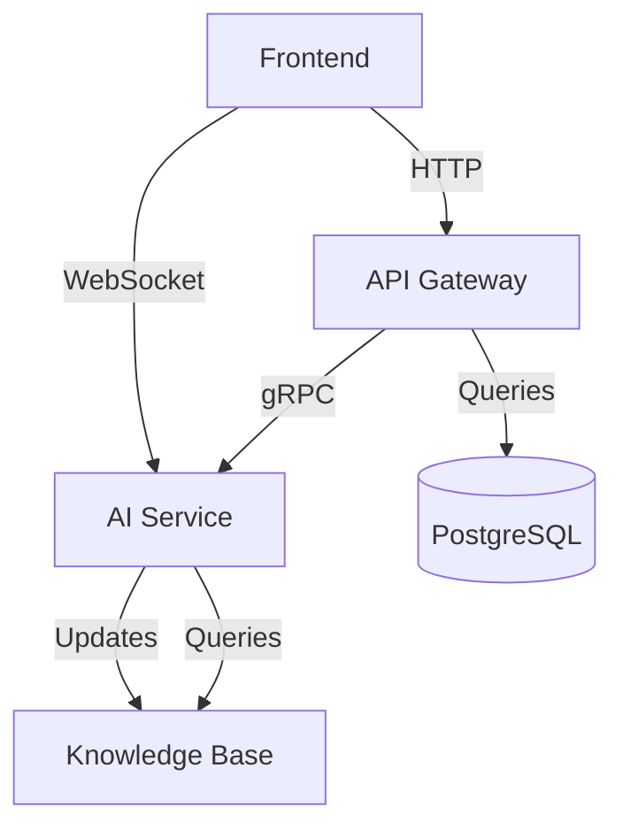

# AI Law Professor - System Patterns

## Architecture Overview
The system follows a hybrid microservices architecture with these main components:

1. **Frontend Application** (TypeScript/Next.js)
   - User interface for students and professors
   - Interactive Q&A interface
   - Case analysis visualization tools
   - Admin dashboard

2. **API Gateway** (Node.js/Express)
   - Routes requests to appropriate services
   - Handles authentication and authorization
   - Rate limiting and request validation

3. **AI Service** (Python/FastAPI)
   - Processes legal questions and generates responses
   - Implements RAG (Retrieval-Augmented Generation)
   - Manages conversation context and memory

4. **Knowledge Base** (ChromaDB + PostgreSQL)
   - Vector store for legal documents and cases
   - Traditional database for user data and metadata with PostgreSQL
   - Regular updates from legal sources
   - PostgreSQL vector extension for embeddings

## Key Design Patterns

### Retrieval-Augmented Generation (RAG)
1. User query is processed for legal concepts
2. Relevant legal documents are retrieved from vector store
3. Context is fed to LLM along with query
4. Response is generated with citations to sources

### Microservices Communication
- Frontend ↔ API Gateway: REST/GraphQL
- API Gateway ↔ AI Service: gRPC
- Services ↔ Databases: Native drivers

### Caching Strategy
- Redis cache for frequent queries
- Cache invalidation on legal updates
- Tiered caching based on query complexity

## Component Relationships

## Data Flow
1. User submits query through frontend
2. API Gateway authenticates and routes request
3. AI Service processes query with RAG pipeline
4. Knowledge Base returns relevant legal context
5. AI Service generates response with citations
6. Response is returned to user through API Gateway

## Error Handling
- Circuit breakers for service dependencies
- Retry policies with exponential backoff
- Graceful degradation of features
- Comprehensive logging and monitoring
